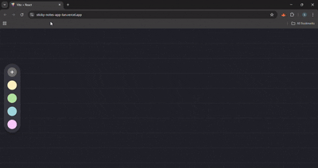

# 🗒️ STICKYNOTESAPP

_Unleash Creativity, Organize Effortlessly, Innovate Instantly_


---

## 🚀 Built with the tools and technologies:


---

## 📌 Overview

**StickyNotesApp** is a playful and intuitive note-taking web app where users can:
- Create colorful sticky notes 📝
- Drag them freely across a board 🧲
- Edit or delete with ease ✏️
- Persist notes between sessions using Appwrite DB 💾

Ideal for brainstorming, quick reminders, or visual organization — right in your browser.

---

## ⚙️ Quickstart

1. Clone the repo  
   ```bash
   git clone https://github.com/SafaMaqbool/stickyNotesApp.git
   cd stickyNotesApp
   ```

2. Install dependencies  
   ```bash
   npm install
   ```

3. Start the development server  
   ```bash
   npm run dev
   ```

4. Open in browser:  
   `http://localhost:3000`

---

## 🧠 Development Journey

* ✅ Set up UI layout and note components
* ✅ Added drag-and-drop logic
* ✅ Integrated Appwrite database for persistent storage
* ✅ Applied CSS styling for visual polish
* ✅ Cleaned up using ESLint and Prettier

---

## 🌈 Future Plans

* 🎨 Color palettes for notes
* 🌙 Dark mode toggle
* 📱 Responsive touch support
* 🗑️ Drag-to-delete zone
* ⏰ Reminders and timestamps

---

## 🎥 Preview

<p align="center">
  <a href="./assets/demo.mp4" target="_blank">
    
  </a>
</p>


## 📬 Feedback & Collaboration

If you've got suggestions, want to report a bug, or collaborate — feel free to [open an issue](https://github.com/SafaMaqbool/stickyNotesApp/issues) or drop a ⭐!
